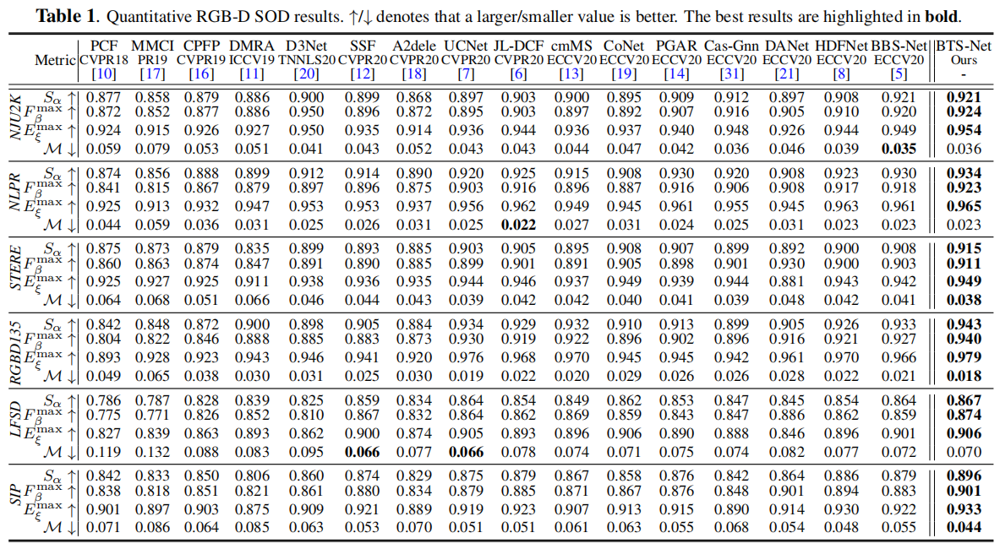

# BTS-Net (ICME 2021)
[BTS-NET: BI-DIRECTIONAL TRANSFER-AND-SELECTION NETWORK FOR RGB-D SALIENT OBJECT DETECTION](https://arxiv.org/pdf/2104.01784.pdf)

      
 <em> 
     Block diagram of the proposed BTS-Net.
    </em>

## 1. Introduction
 ### Features
 - Achieves a new state-of-the-art on 6 public datasets by the time the paper was accepted ([Leaderboard in paper-with-code](https://paperswithcode.com/task/rgb-d-salient-object-detection)).
 - First RGB-D SOD methods to introduce bi-directional interactions across RGB and depth during the encoder stage.
 - Bi-directional Transfer-and-Selection (BTS) module is designed to achieve this idea.
 - An effective light-weight group decoder is designed to improve efficiency.
 ### Easy-to-use to boost your methods
 if you adopt parallel encoders for RGB and depth:
 - In encdoer stage, adopt proposed bi-direcitonal interaction stategy to boost your methods (Naive fusion e.g., pixel-wise addition rather than BTS module may also improve). Or otherwise you adopt uni-directional interaction, I strongly recommend not to use D=>R , even R=>D is consistently better with the same space/time consumption.
 - In decoder stage, adopt our group decoder to replace naive U-Net like deocder to boost efficiency.
 
 If you use a depth branch as an affiliate to RGB branch:
 - refer to our another work [DFM-Net](https://github.com/zwbx/DFM-Net)

## 2. Requirements

 - Python 3.7, Pytorch 1.7, Cuda 10.1
 - Test on Win10 and Ubuntu 16.04

## 3. Data Preparation

 - Download the test data (containing NJU2K, NLPR, STERE, RGBD135, LFSD, SIP) from [Here](https://pan.baidu.com/s/1wI-bxarzdSrOY39UxZaomQ) [code: 940i], trained model (epoch_100.pth) from [Here](https://pan.baidu.com/s/1SbNnFmeW5vHj6tFWgQLSpg) [code: 2j99], training data from [Here](https://pan.baidu.com/s/1ckNlS0uEIPV-iCwVzjutsQ) [code: eb2z].  Then put them under the following directory:
 
	-dataset\ 
	  -RGBD_for_train\
	  -NJU2K\  
	  -NLPR\
	  ...
	-pretrain
	  -epoch_100.pth
	  ...
	  
	  
## 4. Testing & Training
  
- Testing

  Directly run test.py, the test maps will be saved to './resutls/'.

- Evaluate the result maps:
    
    You can evaluate the result maps using the tool in [Matlab Version](http://dpfan.net/d3netbenchmark/) or [Python_GPU Version](https://github.com/zyjwuyan/SOD_Evaluation_Metrics).
    
- Training

  Modilfy setting in options.py and run tarin.py
    

## 5. Results

      
 <em>
  Quantitative comparison with 16 SOTA over 4 metrics (S-measure, max F-measure, max E-measure and MAE) on 6 datasets. 
  </em>

### Download
 - Test results of the above datasets can be download from [here](https://pan.baidu.com/s/19LGDcIpXNF9cdvGnvP_zNA) [code: cujh].
 
## 6. Citation

Please cite the following paper if you use this repository in your reseach

	@inproceedings{Zhang2021BTSNet,
 	 title={BTS-Net: Bi-directional Transfer-and-Selection Network for RGB-D Salient Object Detection},
	  author={Wenbo Zhang and Yao Jiang and Keren Fu and Qijun Zhao},
	  booktitle={ICME},
	  year={2021}
	}

